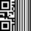

# Barcode .NET
Barcode for .NET Framework and .NET Core

---------------------------------------

See the [changelog](CHANGELOG.md) for changes.

---------------------------------------

## Roadmap

### Main features
- [x] .NET Framework Implementation
- [x] .NET Core Implementation
- [ ] Samples & Tools

### Implementation
- [ ] Code11
- [x] Code128
- [ ] Code25
- [ ] Code39
- [ ] Code93
- [ ] Ean13
- [ ] Ean8
- [ ] PDF417
- [ ] QR